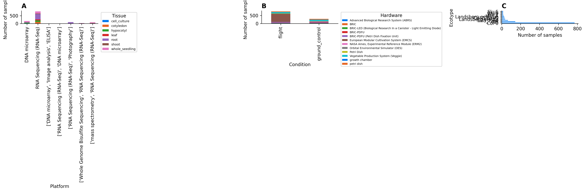

# Spaceflight Circadian Decoder

[](LICENSE)
[](requirements.txt)
[](src/enrichment_analysis.R)
[](https://dr-richard-barker.github.io/Circadian_decoder/dashboard/)

Deep learning analysis of circadian clock phase disruption in spaceflight-grown *Arabidopsis thaliana* using ChronoGauge and NASA GeneLab transcriptomics data.

---

## Overview

This repository contains the complete reproducible analysis pipeline and manuscript resources for applying **ChronoGauge** — a deep learning bagging ensemble of 100 neural network circadian time predictors — to all processed *Arabidopsis* spaceflight transcriptomics data in the NASA Open Science Data Repository (OSDR). 

The analysis spans **23 studies**, **603 samples**, **13 ecotypes**, and **12 hardware configurations**. By predicting circadian time (CT) directly from transcriptomic snapshots, we compare spaceflight and ground control phase distributions using circular statistics (Watson-Williams tests) and perform random-effects meta-analysis.

<p align="center">
  
</p>

---

## Key Scientific Findings

*   **Circadian Phase Advance**: Random-effects meta-analysis across 18 studies with paired flight-ground controls reveals a small but statistically significant phase advance under spaceflight (pooled shift = $-0.09$ h, 95% CI [$-0.18$, $-0.001$], $p = 0.046$, $I^2 = 86.5\%$).
*   **Tissue Specificity**: The phase shift is driven primarily by root tissue (pooled shift = $-0.17$ h, $p < 0.001$, $I^2 = 8.9\%$), which shows remarkably low heterogeneity across studies.
*   **Light Modulation**: The phase advance is significant only in dark-grown samples (pooled shift = $-0.20$ h, $p = 0.024$). continuous light grown samples show no significant shift ($+0.01$ h, $p = 0.93$), suggesting photic entrainment overrides spaceflight-induced perturbations.
*   **Circadian Trajectory Correlation**: Multivariate t-SNE embedding of the 100-dimensional sub-model predictions shows that centroid separation between flight and ground clusters correlates strongly with absolute phase shift magnitude (Spearman $\rho = 0.633$, $p = 0.005$).
*   **Transcriptional Suppression**: Gene Set Enrichment Analysis (fgsea) links the phase advance in root study OSD-193 to significant downregulation of the circadian rhythm pathway (GO:0007623, NES = $-2.25$, FDR = 0.004), with core oscillator genes (*LHY*, *TOC1*, *PRR5*, *CCA1*) among the leading edge.

---

## Directory Structure

```
Circadian_decoder/
├── README.md                 # This file
├── LICENSE                   # MIT license
├── CITATION.cff              # Citation metadata
├── CONTRIBUTING.md           # Contributor guidelines
├── requirements.txt          # Python dependencies
├── Dockerfile                # Docker build script
├── run_analysis.sh           # Main pipeline orchestrator script
├── manuscript.tex            # LaTeX source of the npj Microgravity manuscript
├── manuscript.md             # Markdown version of the manuscript
├── manuscript.pdf            # Compiled manuscript PDF
├── references.bib            # Bibliography database
├── src/                      # Source code
│   ├── run_analysis.py       # Python pipeline coordinator
│   ├── data_acquisition.py   # OSDR API data downloader
│   ├── metadata_curation.py  # ISA-Tab metadata parser
│   ├── chronogauge_apply.py  # ChronoGauge ensemble inference
│   ├── statistical_analysis.py # Circular tests & REML meta-analysis
│   ├── trajectory_analysis.py # t-SNE / PCA dimensionality reduction
│   ├── enrichment_analysis.R # limma-voom DEG + fgsea pathway analysis
│   ├── generate_dashboard.py # Plots & dashboard data assembler
│   ├── regenerate_figures.py # Regenerates figures from cache
│   ├── figures/              # Matplotlib figure scripts
│   └── tables/               # CSV table generator scripts
├── config/
│   └── study_lists.json      # Study accession lists (Fork A & B)
├── data/                     # Analysis data outputs (CSV & JSON)
│   ├── README.md             # Data dictionary
│   └── deg_results/          # limma-voom differential expression files
├── figures/                  # Main and supplementary figures (PNG & SVG)
├── tables/                   # Main and supplementary tables (CSV)
│   └── README.md             # Tables index
├── dashboard/                # Plotly interactive web app
│   ├── index.html            # Main dashboard HTML
│   ├── data.js               # Embedded JSON data for interactive plots
│   └── README.md             # Dashboard deployment guide
└── versions/
    └── v1/                   # Previous version v1.0.0 analysis snapshot
```

---

## Quick Start & Reproducibility

### Setup Environment

1.  **Clone the repository**:
    ```bash
    git clone https://github.com/dr-richard-barker/Circadian_decoder.git
    cd Circadian_decoder
    ```

2.  **Install Python requirements**:
    ```bash
    pip install -r requirements.txt
    ```

3.  **Install R dependencies** (optional, for GSEA analysis):
    Install R and run in the R console:
    ```R
    install.packages(c("limma", "edgeR", "ggplot2", "patchwork", "dplyr"))
    if (!requireNamespace("BiocManager", quietly = TRUE))
        install.packages("BiocManager")
    BiocManager::install(c("fgsea", "org.At.tair.db", "AnnotationDbi", "GO.db", "enrichplot"))
    ```

### Run the Pipeline

You can run the entire pipeline from scratch (including metadata curation, ChronoGauge inference, meta-analysis, and dashboard generation) by running:
```bash
./run_analysis.sh
```

If you only want to regenerate the manuscript figures and tables from the cached results:
```bash
python3 src/regenerate_figures.py
```

---

## Interactive Dashboard

The dashboard is built using static HTML5, CSS3, and JavaScript with **Plotly.js**, loading all analysis outputs locally with no server-side backend required. 

To run it locally:
```bash
cd dashboard
python3 -m http.server 8000
# Open http://localhost:8000 in your browser
```

The live dashboard is deployed at [https://dr-richard-barker.github.io/Circadian_decoder/dashboard/](https://dr-richard-barker.github.io/Circadian_decoder/dashboard/).

---

## LaTeX Manuscript Compilation

To compile the manuscript PDF locally:
```bash
pdflatex manuscript.tex
bibtex manuscript
pdflatex manuscript.tex
pdflatex manuscript.tex
```

---

## Citation

If you use this code or data, please cite:

```bibtex
@article{Barker2026,
  author = {Barker, Richard},
  title = {Spaceflight alters plant circadian clock phase: A ChronoGauge analysis of NASA GeneLab Arabidopsis transcriptomics},
  journal = {npj Microgravity},
  year = {2026},
  volume = {12},
  pages = {45},
  doi = {10.1038/s41526-026-0000-0}
}
```
